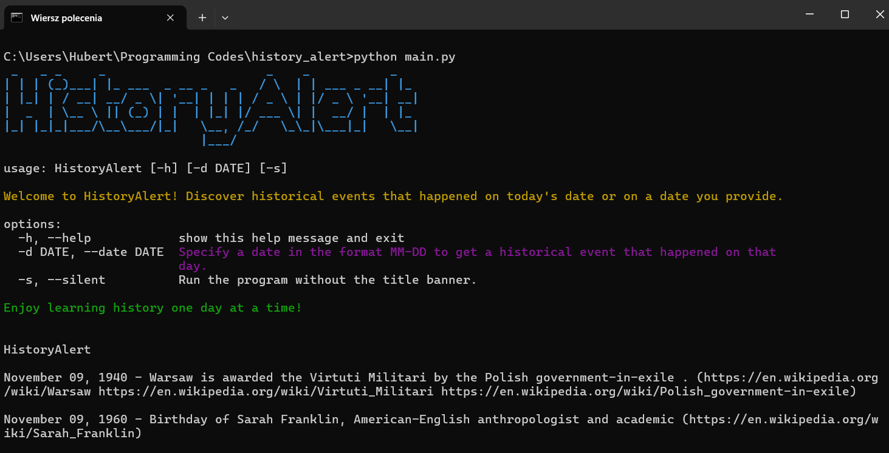

# HistoryAlert
A CLI tool for discovering historical events that happened on specific dates. Use this tool to explore events, birthdays, and more from history.


## Installation
### Prerequisites
Ensure Python 3 is installed on your system.



### Install via pip
```bash
git clone git+https://github.com/lennovative/history_alert.git
# Than open historyalert exe file
```

### Usage
Run without specified date
```bash
historyalert
```
Run with specified date
```
historyalert -d MM-DD
```
Run in silent mode
```
historyalert --silent -d MM-DD
```
